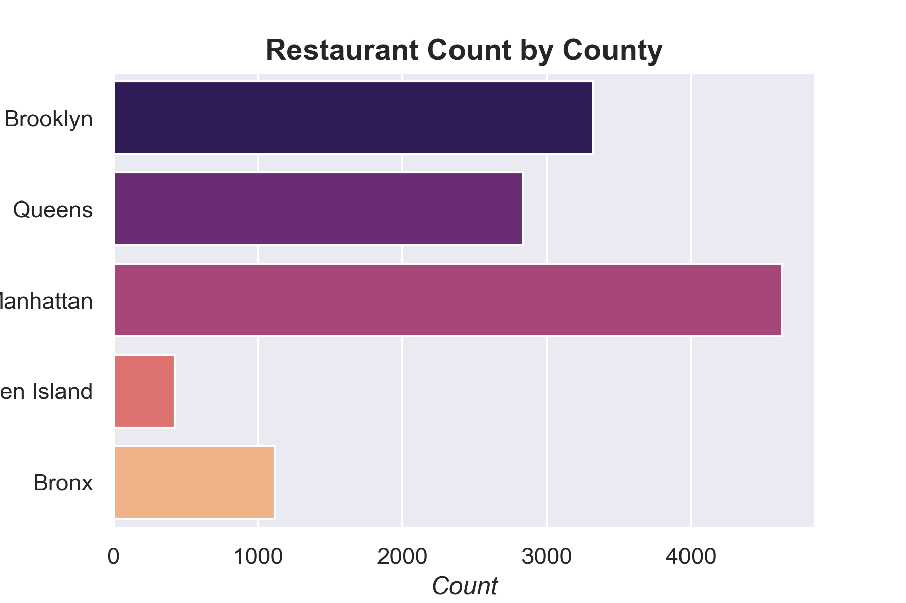

# **New York City Restaurant Inspections**

## **Introduction**
***
Restaurants and food service establishments are inspected by the New York City Health Department to ensure compliance with food safety regulations, in the prevention of foodborne illnesses. 

The City requires restaurants to post the letter grades that correspond to the total violations points found during sanitary inspections. All grades must be posted at the front entrance of the establishment, where they can be easily seen by potential customers. 

*Note: An inspection score of 0 to 13 points is an 'A' grade, 14 to 27 points is a 'B' grade and 28 or more points is a 'C' grade.* 

### **Purpose of Repository**
***
This repository was built to analyze the inspection grades for *active* restaurants across the five boroughs in New York City up to March 8, 2023. 

The analyses are supported by visualizations which give insight into grade variation by location and cuisine/food type, and possible biases in the restaurant inspection system.

### **Structure and Use of Repository Files**
***
The main directory contains an information file and two subdirectories: *Python Scripts* and *Tableau*.

#### *A. [Information File](About_NYC_Restaurant_Inspection_Data_on_NYC_OpenData_Information_File.pdf)*
This file serves as a guide to explain the records in the dataset, particularly how scores and grades are assigned based on the types of violations and inspections. Some parts of this file are referenced as comments in the Python scripts.

#### *B. [Python Scripts](Python%20Scripts)*
This subdirectory contains the scripts (collection of codes) created to clean the input data and produce a simplified version of the dataset for import into Tableau for visualization. 

- Input Data File: 
    - The scripts are built to run using the the file *[NYC_Restaurant_Inspection_Results.csv](NYC_Restaurant_Inspection_Results.csv)*, which was downloaded on March 8, 2023. To download the latest dataset, go to the [*NYC Open Data*](https://data.cityofnewyork.us/Health/DOHMH-New-York-City-Restaurant-Inspection-Results/43nn-pn8j), click 'Export' and be sure to download the New York City Restaurant Inspection Results as CSV.

- Run Scripts: 
    - There are six scripts which must be executed in logical sequence beginning with inspections_step_1.py. More information on each script is detailed [here]().
        

- Output Data Files: 
    - Three files are built when the scripts listed above are ran on a Python interpreter:
        - [trim.CSV](trim.csv): this is main output file containing 12,332 records of active restaurants. Among the 18 variables, those of most relevance for visualization include: 'grade', 'score', 'boro'(borough), 'year' (year of inspection), 'std_dba'(restaurant name) and 'lat' and 'long' (geographic coordinates).
        - [count_boro.png](count_boro.png): this figure shows the count (or number) of restaurants in each of the five boroughs.
        - [count_cuisine_foodtype.png](count_cuisine_foodtype.png): this figure shows the count (or number) of restaurants by food type/cuisine. Note: Only food type/cuisine with a minimum count of 100 is shown.

#### *C. [Tableau](Tableau)*
This subdirectory contains the following files:
 - [trim.CSV](trim.csv): the main output file built when Python scripts are run. Once imported into Tableau, the data is used to create several visualizations.
 - [NYC-Resturant-Inspections-Visualization.twb](Tableau/NYC-Resturant-Inspections-Visualization.twb): In this workbook, there are four worksheets:
    - *Map Overview* - Spatial distribution of grades across boroughs
    - *Grade by Food Type/Cuisine* - Bar Chart showing the share of grades by food type/cuisine
    - *Grade by Borough* - Bar chart showing the share of grades across the boroughs
    - *Grade Count by Year* - Line graph showing the variation in grades by the year of inspection (i.e. 2013 to 2023).

**Worksheets were used to create an interactive dashboard, [New York City Restaurant Inspections](https://public.tableau.com/app/profile/gabriella.alphonso/viz/NYCResturantInspections/NYCRestaurantsInspections).** 

### **Main Findings**
---
 In this dataset, most of the restaurants are located in Manhattan, while Staten Island has the lowest count among the five boroughs (Figure 1). Among the inspected restaurants, ‘American’ type food or cuisine has the largest count (Figure 2) and the greatest share of grade ‘A’ (Figure 3).

 
 
Using the interactive dashboard created in Tableau, users can dig deeper into the data by filtering on demand, hovering over and selecting different visuals. By exploring the underlying information on restaurant inspections, users can determine for themselves whether possible biases exist in the inspection grading system exist. 

It is also important to consider how easily facilities can comply with State health code regulations because of well-developed and fully implemented food safety plans. In the prevention of foodborne outbreaks and as an FDA requirement, every food service operator is required to have a food safety or HACCP plan that identifies foreseeable hazards, and details written procedures to prevent, control and correct the occurrence of same in its facility. Franchise food operators may have better implementation and monitoring of food safety plans and therefore, compliance with State health code is easier. The opposite may be true for smaller, family-owned establishments in which poorly designed and/or implemented food safety plans contribute in part to reduced compliance with the health code resulting in lower inspection score and grade. 
